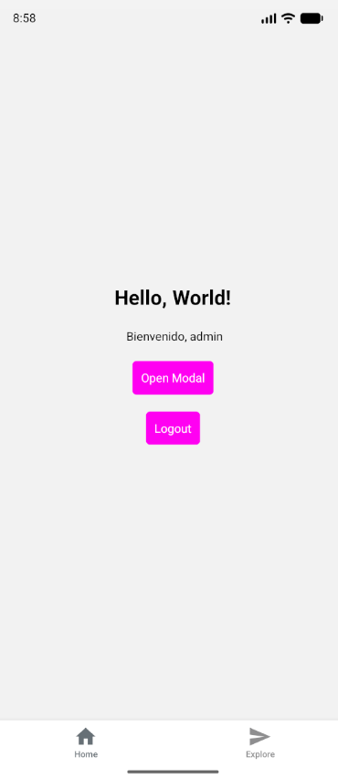
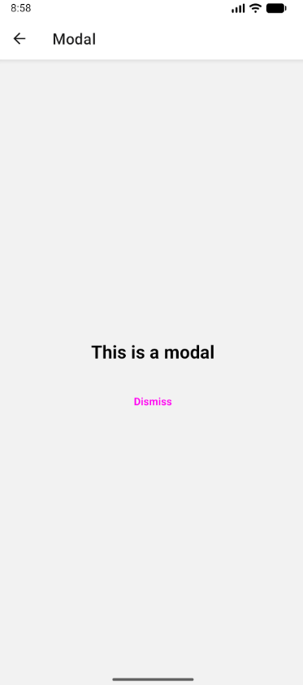

# LoginReact

Aplicación desarrollada con **React Native y Expo** que implementa un sistema básico de **inicio de sesión (Login)** con validación de credenciales, interfaz moderna y navegación estructurada.  
Además, contempla un módulo de **To Do List** donde cada tarea puede incluir **imagen** y **georeferencia**.
El proyecto forma parte de una evaluación académica de la asignatura **Desarrollo de Aplicaciones Móviles** del **Instituto Profesional San Sebastián**.

---

## Características principales

- Pantalla de **login funcional** con validación local de usuario y contraseña.  
- **To Do List**
    - Creación de tareas con título
    - Posibilidad de **adjuntar una foto** tomada con la cámara
    - Obtención de la **ubicación actual** del dispositivo (georreferencia) para asociarla a la tarea
    - Visualización de las tareas en una lista
- Diseño adaptable a **plataformas web y móviles** (Expo Web / Android).  
- Navegación estructurada mediante **Expo Router**.  
- Manejo de autenticación con **Context API**.  
- Estilos personalizados con `StyleSheet` (borde dinámico, colores y diseño centrado).  
- Compatible con el flujo de trabajo de **Expo CLI**, **Android Studio** y **VS Code**.

---

## Tecnologías utilizadas

| Tecnología | Uso principal |
|-------------|----------------|
| **React Native** | Framework base para la app móvil |
| **Expo** | Entorno de desarrollo y ejecución multiplataforma |
| **TypeScript** | Tipado estático para componentes y funciones |
| **React Navigation (Expo Router)** | Navegación entre pantallas |
| **Context API** | Manejo de sesión (login/logout) |
| **expo-image-picker** | Captura de imagen para las tareas |
| **expo-location** | Obtención de la ubicación del dispositi |
| **Git & GitHub** | Control de versiones y repositorio remoto |
| **Android Studio + Emulador** | Pruebas en entorno Android virtual |

---

---

## Módulo To Do List: imagen + georreferencia

El módulo de tareas incorpora funcionalidades multimedia y de ubicación:

### Flujo de uso

1. El usuario inicia sesión en la aplicación.
2. Accede a la pestaña del **To Do List**.
3. Para crear una nueva tarea:
   - Ingresa el **título** de la tarea.
   - (Opcional) Toma una **foto** con la cámara o elige una imagen desde la galería mediante `expo-image-picker`.
   - (Opcional) Solicita la **ubicación actual**; la app pide permiso y obtiene las coordenadas mediante `expo-location`.
4. La tarea se guarda en memoria junto a:
   - `id` único.
   - `title`.
   - `completed` (estado).
   - `imageUri` (cuando se adjunta foto).
   - `location` (latitud / longitud cuando se autoriza la geolocalización).

### Permisos

- En la primera vez que se utiliza la cámara/galería, la app solicita permisos a través de **`expo-image-picker`**.
- Para la georreferencia, la app solicita permisos de ubicación mediante **`expo-location`**.
- Si el usuario deniega los permisos, la app muestra mensajes informativos y la funcionalidad asociada (foto o ubicación) se desactiva para esa operación.

---

## Estructura del proyecto

```text
EVA1/
  app/
    (tabs)/                 # Pantallas con navegación tipo tabs
      _layout.tsx           # Layout principal de pestañas
      index.tsx             # Pantalla principal
      explore.tsx           # Pantalla secundaria
      profile.tsx           # Pantalla de perfil / To Do List

    _layout.tsx             # Layout global de la app
    login.tsx               # Pantalla de Login
    modal.tsx               # Pantalla Modal

  components/               # Componentes reutilizables (UI)
      ui/                   # Botones, items de lista, etc.

  constants/                # Colores, temas, variables globales
  assets/                   # Imágenes y recursos estáticos
  scripts/                  # Scripts adicionales
  utils/                    # Funciones auxiliares (por ejemplo, generación de IDs)

  package.json              # Dependencias y configuración
  app.json                  # Configuración de Expo
  tsconfig.json             # Configuración de TypeScript
  README.md                 # Este documento
```

---

## Instalación y ejecución

### 1️⃣ Clonar el repositorio
```bash
git clone https://github.com/malumirandac/LoginReact.git
cd LoginReact
```

### 2️⃣ Instalar dependencias
```bash
npm install
```

### 3️⃣ Iniciar la aplicación
```bash
npx expo start
```

Esto abrirá el panel de **Expo** en tu navegador.  

Desde ahí puedes:
- Presionar **w** para ejecutar la app en modo **web**.  
- Presionar **a** para abrirla en un emulador o dispositivo **Android** (si tienes Android Studio configurado).

---

## Emulación en Android

La aplicación fue probada en un **emulador Android** creado con **Android Studio**, y ejecutado directamente desde **Visual Studio Code** mediante la extensión **"Android iOS Emulator"**.  

Para iniciar el proyecto y abrirlo en el emulador se utiliza:

```bash
npx expo start
```

Luego, con el emulador ya encendido, se presiona la tecla:
```bash
a
```
Esto lanza la aplicación automáticamente dentro del entorno Android virtual.

---

## Detalles técnicos de la emulación

- **Plataforma utilizada:** Android Studio (Virtual Device Manager)  
- **Extensión en VSCode:** *Android iOS Emulator*  
- **Comando de ejecución:** `npx expo start` + `a`  
- **Framework:** Expo + React Native  
- **Resultado:** la aplicación abre correctamente en el dispositivo virtual Android, mostrando primero la pantalla de login.

---

## Credenciales de prueba

Usuario | Contraseña
---------|------------
user | 1234
admin | admin
malu | malu123
boris | boris123

---

## Lógica principal

- Las credenciales se validan en memoria mediante un arreglo `EXPECTED_USERS`.  
- Si los datos son correctos, se actualiza el contexto global (`AuthContext`) con la información del usuario.  
- En caso de error, se muestra una alerta nativa (`Alert.alert` en móvil o `window.alert` en web).  

---

## Estilos

- Implementados con **StyleSheet**.  
- Borde de input personalizable (rosa/morado según estado).  
- Botones con color destacado `#ff00f2ff` y texto blanco.  
- Fuentes limpias y centrado de elementos.
- Estilos específicos para indicadores de tareas completadas y botones de acción.

---

## Video demostrativo

Puedes ver el funcionamiento de la aplicación en el siguiente video:

[Ver video de demostración](https://ipciisa-my.sharepoint.com/:v:/g/personal/francisca_miranda_cortes_estudiante_ipss_cl/IQA8LVcn7NmpQrLzisZoKxOMAbRomMy2_Wpgy3dMuigHOhw?nav=eyJyZWZlcnJhbEluZm8iOnsicmVmZXJyYWxBcHAiOiJPbmVEcml2ZUZvckJ1c2luZXNzIiwicmVmZXJyYWxBcHBQbGF0Zm9ybSI6IldlYiIsInJlZmVycmFsTW9kZSI6InZpZXciLCJyZWZlcnJhbFZpZXciOiJNeUZpbGVzTGlua0NvcHkifX0&e=c8D1IA)


---

## Capturas de pantalla

| Pantalla        | Descripción                          |
|-----------------|--------------------------------------|
|  | Pantalla inicial de Login |
|    | Menú principal con pestañas |
|  | Pantalla de Modal |


---

## Scripts útiles

Comando | Descripción
---------|-------------
npm start | Inicia el servidor de desarrollo de Expo
npm run web | Ejecuta la app en el navegador
npm run android | Ejecuta la app en Android (requiere emulador)
git push | Sube los cambios a GitHub

---

## Autores

**Malú Miranda Cortés, Matías Marques Ferrada**  
Estudiante del **Instituto Profesional San Sebastián**  
Carrera: *Ingeniería en Informática*  
Asignatura: *Desarrollo de Aplicaciones Móviles*

---

## Licencia

Este proyecto se distribuye con fines educativos.  
El código puede ser reutilizado o modificado con fines académicos o de aprendizaje.